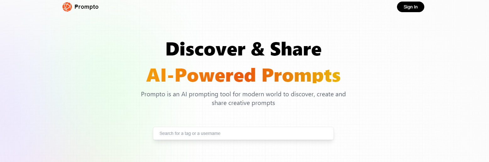
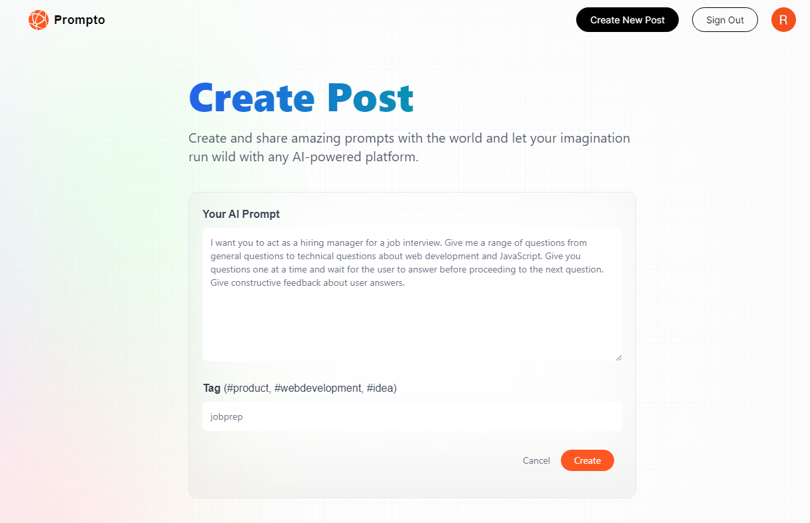
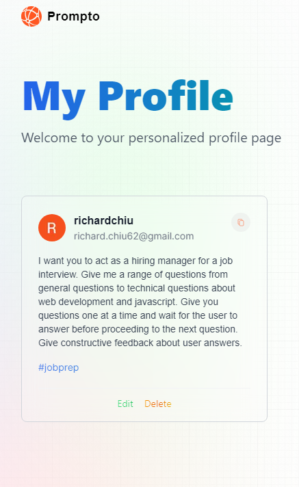

# Prompto



<!-- ```sh
hosted on: "change once established"
``` -->

## Introduction

Prompto is a CRUD based application that is made with NextJs. Create and share AI prompts for LLM's for others to use!

This application contains:

- search functionality for other user's post
- edit/delete for user posts
- data persistence with profile page
- ability to see other user profiles



